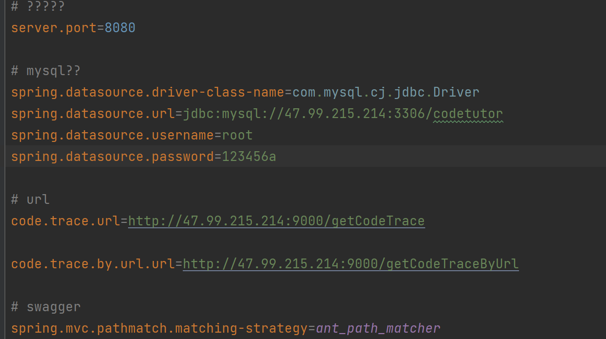

# Docker部署文档


### 安装mysql

1. 拉取mysql镜像

   `docker pull mysql:8.0`

2. 启动mysql容器服务

   `docker run --name mysql-server -e MYSQL_ROOT_PASSWORD=123456a -p 3306:3306 -d --restart always mysql:8.0`

3. 建立database和table

   建表语句详见`/backend/codetutor.sql`


### 部署PythonTutor服务

1. 拉取pythontutor镜像

   可使用Dockerfile构建镜像，这里已经构建好了并push到了dockerhub，其地址为`nico817/codetutor_codetrace_service:v3`，使用pull命令直接拉取即可，`docker pull nico817/codetutor_codetrace_service:v3`
   
   正常拉取过慢，解决方案为：
   
   `export REPO=docker.m.daocloud.io`
   
   `docker pull ${REPO}/nico817/codetutor_codetrace_service:v3`
```dockerfile
# 基础镜像
FROM python:3.11
# 维护者信息
LABEL maintainer="21302010045@m.fudan.edu.cn"
# 设置⼯作⽬录
WORKDIR /app
# 将当前⽬录中的⽂件复制到镜像的/app⽬录中
COPY . /app
# 安装Flask 和 requests 库
RUN pip install Flask requests
# 暴露应⽤程序运⾏的端⼝
EXPOSE 9000
# 运行命令
CMD ["python", "main.py"]
```

2. 启动pythontutor容器服务

   `docker run --name pythontutor -p 9000:9000 -d --restart always docker.m.daocloud.io/nico817/codetutor_codetrace_service:v3` 


### 部署后端服务

1. 修改后端配置

   

2. 使用IDEA的package功能打包成jar包

3. 使用Dockerfile构建镜像

``` dockerfile
# 使用openjdk:8-jdk-alpine镜像
FROM openjdk:8-jdk-alpine
# 维护者信息
LABEL maintainer="21302010045@m.fudan.edu.cn"
# 设置工作目录
WORKDIR /app
#将当前 target 目录下的 jar 放置在 app 目录下
ADD target/codetutor-0.0.1-SNAPSHOT.jar  /app/
# 设置时区
ENV TZ="Asia/Shanghai"
# 设置镜像对外暴露端口
EXPOSE 8080
#执行启动命令
ENTRYPOINT ["java", "-jar","codetutor-0.0.1-SNAPSHOT.jar"]
```

在/backend/codetutor终端下运行命令`docker build -t codetutor_backend -f Dockerfile .`

可以运行命令`docker run -d -p 8080:8080 codetutor_backend`在本地进行测试

4. 将打包好的镜像push到dockerhub上

   `docker login --username=aliyun3490758939 registry.cn-hangzhou.aliyuncs.com`

   `docker tag codetutor_backend registry.cn-hangzhou.aliyuncs.com/nico817/codetutor_backend:v1`

   `docker push registry.cn-hangzhou.aliyuncs.com/nico817/codetutor_backend:v1`

5. 拉取后端镜像

   `docker login --username=aliyun3490758939 registry.cn-hangzhou.aliyuncs.com`

    `docker pull registry.cn-hangzhou.aliyuncs.com/nico817/codetutor_backend:v1`

6. 启动后端服务

   `docker run --name codetutor_backend -p 8080:8080 -d --restart always registry.cn-hangzhou.aliyuncs.com/nico817/codetutor_backend:v1`
   
   

### 前端部署

Dockerfile配置

```dockerfile
# 基本的镜像
FROM node as builder
# 工作目录
WORKDIR /usr/src/app
# 复制
COPY . .
# 下载配置和构建
RUN npm install
RUN npm run build --prod
# 配置nginx
FROM nginx:1.17
COPY --from=builder /usr/src/app/dist/codetutor /usr/share/nginx/html
#设置用户标签
LABEL maintainer="21302010045@m.fudan.edu.cn"
COPY ./nginx-angular.conf /etc/nginx/conf.d/default.conf
```
nginx.conf

```nginx
server {
  listen 80;

  location / {
    root /usr/share/nginx/html/browser;
    index index.html;
    try_files $uri $uri/ /index.html;
  }
}
```

构建镜像

`docker build -t codetutor_frontend .` 

上传镜像

`docker login --username=aliyun3490758939 registry.cn-hangzhou.aliyuncs.com`

`docker tag codetutor_frontend registry.cn-hangzhou.aliyuncs.com/nico817/codetutor_frontend:v9`

`docker push registry.cn-hangzhou.aliyuncs.com/nico817/codetutor_frontend:v9`

拉取镜像

`docker pull registry.cn-hangzhou.aliyuncs.com/nico817/codetutor_frontend:v9`

运行前端

`docker run --name codetutor_frontend -p 80:80 -d --restart always registry.cn-hangzhou.aliyuncs.com/nico817/codetutor_frontend:v9`
